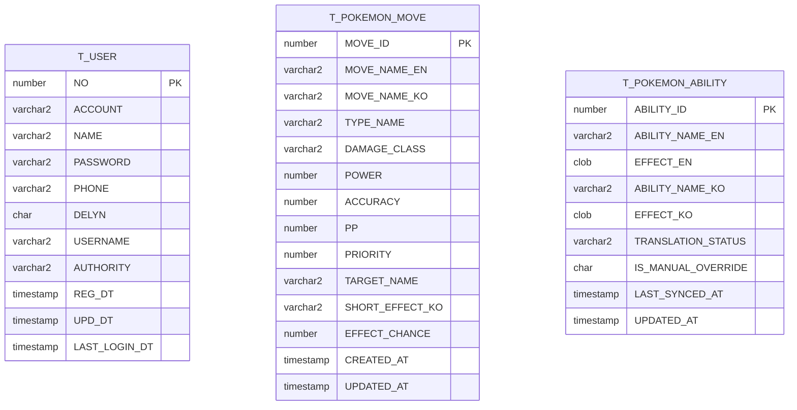

# 데이터베이스 스키마

JPA 엔티티(`com.waldo` 패키지)가 **스키마의 기준(source of truth)**입니다. 이 문서는 포트폴리오·온보딩용 요약이며, 컬럼 타입은 운영 기준인 **Oracle**에 맞춰 설명합니다.

## 환경별 동작

| 프로필 / DB | 스키마 생성 | 비고 |
|-------------|---------------|------|
| `dev` + H2 | `ddl-auto: create-drop` | 인메모리, 앱 기동 시 Hibernate가 테이블 생성 |
| `oracle` | `ddl-auto: none` | **DB에 객체가 미리 있어야 함**. 참고용 DDL은 [`schema/oracle-ddl.sql`](./schema/oracle-ddl.sql) |

`application.yml` 주석: 로컬에 `application-local.yml`이 있으면 Oracle 설정이 `dev`의 H2 설정을 덮어쓸 수 있습니다.

## ER 개요

현재 애플리케이션 엔티티 간 **FK 관계는 없고**, 테이블은 각각 독립적으로 조회·동기화됩니다.

## 테이블 요약

### `T_USER`

회원·로그인·프로필에 사용하는 사용자 테이블. `NO`는 시퀀스 `seq_t_user_no`로 채번합니다.

| 컬럼 | 타입(Oracle) | NULL | 설명 |
|------|----------------|------|------|
| `NO` | `NUMBER` | N | PK, `seq_t_user_no.NEXTVAL` |
| `ACCOUNT` | `VARCHAR2(30)` | Y | |
| `NAME` | `VARCHAR2(30)` | Y | |
| `PASSWORD` | `VARCHAR2(4000)` | Y | 해시 등 저장 (API 응답에서 제외) |
| `PHONE` | `VARCHAR2(30)` | Y | |
| `DELYN` | `CHAR(1)` | N | 삭제 여부 등 플래그 |
| `USERNAME` | `VARCHAR2(30)` | Y | |
| `AUTHORITY` | `VARCHAR2(30)` | Y | |
| `REG_DT` | `TIMESTAMP` | N | 가입 시각 |
| `UPD_DT` | `TIMESTAMP` | Y | |
| `LAST_LOGIN_DT` | `TIMESTAMP` | Y | |

엔티티: `com.waldo.TUser`

---

### `T_POKEMON_MOVE`

PokéAPI 등에서 가져온 기술(move) 메타데이터. 한국어 이름·위력·분류 등 UI·데미지 계산기에서 사용합니다.

| 컬럼 | 타입(Oracle) | NULL | 설명 |
|------|----------------|------|------|
| `MOVE_ID` | `NUMBER` | N | PK, 게임 내 move id |
| `MOVE_NAME_EN` | `VARCHAR2(100)` | N | 영문명 |
| `MOVE_NAME_KO` | `VARCHAR2(200)` | Y | 국문명 |
| `TYPE_NAME` | `VARCHAR2(30)` | N | 타입명 |
| `DAMAGE_CLASS` | `VARCHAR2(20)` | N | 물리/특수/변화 등 |
| `POWER` | `NUMBER` | Y | 위력 |
| `ACCURACY` | `NUMBER` | Y | 명중률 |
| `PP` | `NUMBER` | Y | |
| `PRIORITY` | `NUMBER` | Y | 우선도 |
| `TARGET_NAME` | `VARCHAR2(50)` | Y | 대상 |
| `SHORT_EFFECT_KO` | `VARCHAR2(1000)` | Y | 짧은 효과 설명(한국어) |
| `EFFECT_CHANCE` | `NUMBER` | Y | 추가효과 확률(%) |
| `CREATED_AT` | `TIMESTAMP` | Y | |
| `UPDATED_AT` | `TIMESTAMP` | Y | |

엔티티: `com.waldo.user.data.pokemon.PokemonMoveEntity`

---

### `T_POKEMON_ABILITY`

특성(ability) 영문 효과·번역 상태 등을 저장합니다. 긴 설명은 `CLOB`입니다.

| 컬럼 | 타입(Oracle) | NULL | 설명 |
|------|----------------|------|------|
| `ABILITY_ID` | `NUMBER` | N | PK |
| `ABILITY_NAME_EN` | `VARCHAR2(100)` | Y | |
| `EFFECT_EN` | `CLOB` | Y | 영문 장문 효과 |
| `ABILITY_NAME_KO` | `VARCHAR2(200)` | Y | |
| `EFFECT_KO` | `CLOB` | Y | 국문 장문 효과 |
| `TRANSLATION_STATUS` | `VARCHAR2(20)` | Y | 번역/동기화 상태 |
| `IS_MANUAL_OVERRIDE` | `CHAR(1)` | Y | 수동 보정 여부 |
| `LAST_SYNCED_AT` | `TIMESTAMP` | Y | 마지막 동기화 시각 |
| `UPDATED_AT` | `TIMESTAMP` | Y | |

엔티티: `com.waldo.games.pokemon.PokemonAbilityEntity`

---

## 참조 DDL

Oracle에 수동으로 객체를 만들 때는 [`schema/oracle-ddl.sql`](./schema/oracle-ddl.sql)을 스키마에 맞게 실행하세요. H2 개발 모드에서는 보통 이 파일이 **필요하지 않습니다**.

## 엔티티와 문서가 어긋날 때

엔티티 Java 파일을 먼저 수정한 뒤, 이 문서와 `oracle-ddl.sql`을 같은 기준으로 맞추는 것을 권장합니다.
